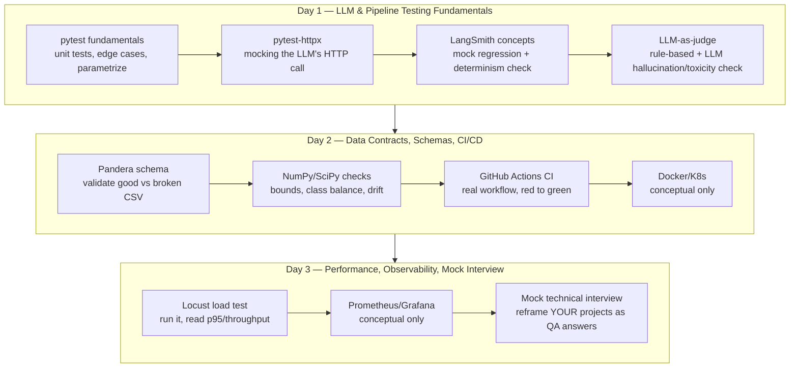

# Module 7: QA / Data Science Engineer — 3-Day Interview Bootcamp

You're an experienced backend/AI engineer (Node.js, Python, LLM
orchestration, multi-agent systems) with **zero formal QA/testing
background** — no pytest, Pandera, Locust/k6, LangSmith, or CI-integrated
ML testing. This module is a 3-day, hands-on crash course built to close
that gap for a specific interview, not a general testing course.

**How this module works:** everything here is scaffolding and TODO
exercises, not finished code. You write the tests; this module gives you
the pipeline to test against, the exact task list, sample data with
planted bugs, and (in each day's `solutions/` folder) a reference
implementation to check against *after* you've attempted it yourself. The
Socratic part — quizzes, code critique, and the Day 3 mock interview —
happens by continuing the conversation with the assistant that built this,
using the checkpoint questions in each day's README as the script.

## The 3-day roadmap



## Day-by-day schedule (fits in a few focused hours each)

| Day | Focus | Time | Folder |
|-----|-------|------|--------|
| 1 | LLM & pipeline testing fundamentals | ~3-4h | [`day1_llm_pipeline_testing/`](./day1_llm_pipeline_testing/) |
| 2 | Data contracts, schemas, CI/CD | ~3-4h | [`day2_data_contracts_ci/`](./day2_data_contracts_ci/) |
| 3 | Performance, observability, mock interview | ~3-4h | [`day3_perf_observability_interview/`](./day3_perf_observability_interview/) |

## Setup (once, before Day 1)

```bash
cd Module-7-QA-DS-Engineer-Bootcamp
pip install -r requirements-qa.txt
```

Python 3.11+ assumed (matches this environment). Each day also has its own
`pytest.ini` so you can `cd` into that day's folder and just run `pytest`.

## Directory map

```
Module-7-QA-DS-Engineer-Bootcamp/
├── requirements-qa.txt
├── day1_llm_pipeline_testing/
│   ├── pipeline/            # the stub mock-LLM + rule-based classifier you test against
│   ├── tests/               # TODO test stubs -- your work
│   ├── langsmith_mock/      # LangSmith concept + local mock exercise
│   ├── llm_judge/           # rule-based + LLM-as-judge exercise
│   └── solutions/           # reference solutions -- attempt first!
├── day2_data_contracts_ci/
│   ├── data/                # good_predictions.csv + broken_predictions.csv (6 planted defects)
│   ├── schemas/              # Pandera schema TODO
│   ├── validation/           # NumPy/SciPy statistical checks TODO
│   ├── tests/                # tying it together
│   ├── docker_k8s_concepts.md
│   └── solutions/
└── day3_perf_observability_interview/
    ├── mock_service/         # FastAPI mock inference endpoint
    ├── load_test/            # Locust TODO exercise + k6 reference script
    ├── observability_concepts/
    ├── mock_interview/        # question bank for the live mock interview
    └── solutions/

.github/workflows/qa-ds-bootcamp-ci.yml   # real CI, scoped to this module, runs Day 1+2 tests
```

## Reality check — what's genuinely learnable hands-on in 3 days vs. talk-fluently-only

This is flagged per-day in each README, collected here for a fast pre-interview skim:

**Build hands-on (this module gets you there):**
- pytest fundamentals: assertions, fixtures, `parametrize`, `pytest.raises`
- Mocking HTTP-based LLM calls with `pytest-httpx`
- The *shape* of LangSmith's regression/determinism workflow (via a local mock)
- Rule-based + LLM-as-judge hallucination/toxicity checks
- Pandera schema definition and validation (including `lazy=True`)
- NumPy/SciPy statistical invariants (bounds, class balance, KS-test drift)
- Reading and adapting a real GitHub Actions ML CI workflow
- Running Locust against a mock service and correctly reading p95/throughput output

**Know conceptually, don't attempt hands-on (time-boxed out on purpose):**
- Real LangSmith account/dashboard setup — the concepts transfer directly, the UI doesn't need touching
- Fine-tuning or seriously prompt-engineering a production-grade judge model
- Kubernetes-based test infrastructure (Jobs, sidecars, ephemeral namespaces) — `day2_data_contracts_ci/docker_k8s_concepts.md` covers what to say
- k6 (read the reference script, understand it vs. Locust, don't install it)
- Standing up real Prometheus + Grafana + Alertmanager
- Branch-protection administration across a real multi-repo org

Being explicit about this split in the actual interview — "I built X hands-on
in my prep, and I understand Y conceptually but haven't set it up myself" —
reads as more credible than implying uniform depth across everything.

## After you finish all 3 days

Come back to the conversation and ask to run the Day 3 mock interview using
your own real projects — that's the part of this bootcamp that isn't a
file in this repo, it's a conversation.
