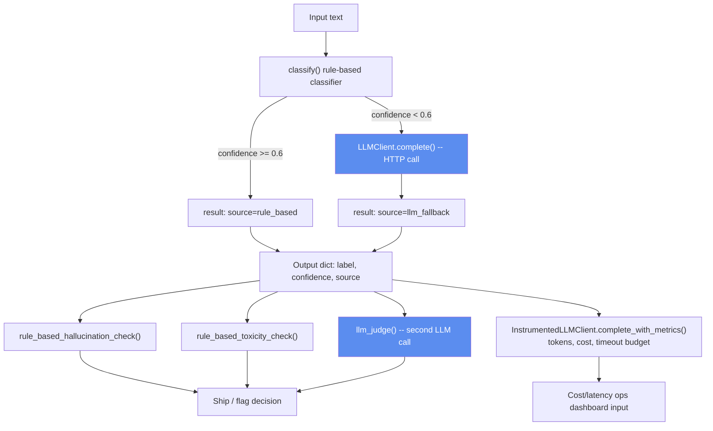

# Day 1 — LLM & Pipeline Testing Fundamentals

**Time budget: ~3-4 focused hours.** Work top to bottom. Don't skip to
solutions/ before attempting each exercise — the value is in getting stuck,
not in reading correct code.

## What you're testing today



The two blue boxes are the only places a real network/API call happens —
and therefore the only places your tests need to mock anything. Everything
else is pure Python you can test directly.

## Setup

```bash
cd Module-7-QA-DS-Engineer-Bootcamp
pip install -r requirements-qa.txt
cd day1_llm_pipeline_testing
pytest -v          # everything will FAIL right now -- that's the starting line, not a bug
```

Every test currently raises `NotImplementedError`. Your job is to make them
pass by implementing them (Exercises A, B, E) or by implementing the
functions under test (Exercises C and D) — read each file's docstring for
the exact task list.

## Order of operations

| # | Exercise | Files | Concept |
|---|----------|-------|---------|
| 1 | A | `tests/test_classifier_todo.py` | pytest fundamentals: assert, `pytest.raises`, `parametrize`, edge cases |
| 2 | B | `tests/test_pipeline_todo.py` | mocking HTTP calls with `pytest-httpx` |
| 3 | C | `langsmith_mock/langsmith_stub.py` | regression testing & determinism checks (LangSmith concept) |
| 4 | D | `llm_judge/judge_todo.py` | rule-based + LLM-as-judge hallucination/toxicity checks |
| 5 | E | `genai_ops_monitoring/cost_monitor_todo.py`, `tests/test_cost_monitoring_todo.py` | token/cost estimation, timeout-budget enforcement, testing time-dependent code via dependency injection |

Run `pytest -v` after each exercise to see your progress move from red to
green. Bring your attempt back to the chat before moving to the next
exercise — you'll get asked to explain *why* each test exists, not just
shown whether it passes.

## Checkpoint quiz (answer before moving to Day 2)

1. Why do we mock at the `httpx` transport layer instead of patching
   `LLMClient.complete` with `unittest.mock.patch`? Give a concrete bug
   that method-patching would miss.
2. In `run_pipeline`, what's the actual business risk if someone lowers
   `LOW_CONFIDENCE_THRESHOLD` from 0.6 to 0.3 without new tests? Name the
   test that would catch it.
3. What's the difference between what a **schema** check would catch vs.
   what an **LLM-judge** check would catch, for the exact same bad output?
4. Your `llm_judge()` failed to parse the model's response. You chose to
   fail safe / fail open / raise — defend your choice for a customer-facing
   summarization feature vs. an internal analytics feature. Would you make
   a different choice for each?
5. Why is injecting a `clock` callable into `InstrumentedLLMClient` a
   better testing design than calling `time.perf_counter()` directly and
   monkeypatching the global `time` module in tests?
6. A prompt template change doubles token usage per call but the outputs
   still look correct. Which of Day 1's exercises (A-D) would catch this,
   and which wouldn't? What does that tell you about test coverage
   "correctness" vs. test coverage "operability"?

## Reality check

- **Realistic to build hands-on in 3 days:** everything in this folder.
  pytest fundamentals, HTTP mocking, and the *shape* of LangSmith/judge
  workflows are all learnable and demonstrable in a few hours.
- **Not realistic to get hands-on in 3 days (talk about it fluently
  instead):** wiring up a real LangSmith account/dashboard, fine-tuning or
  even prompt-engineering a production-grade judge model, building a real
  toxicity classifier, using a real tokenizer (`tiktoken`) instead of the
  chars-per-token approximation in Exercise E. Know the concepts and be
  honest in the interview that your hands-on experience here is a
  deliberately scoped-down mock — that honesty reads better than
  pretending otherwise.
