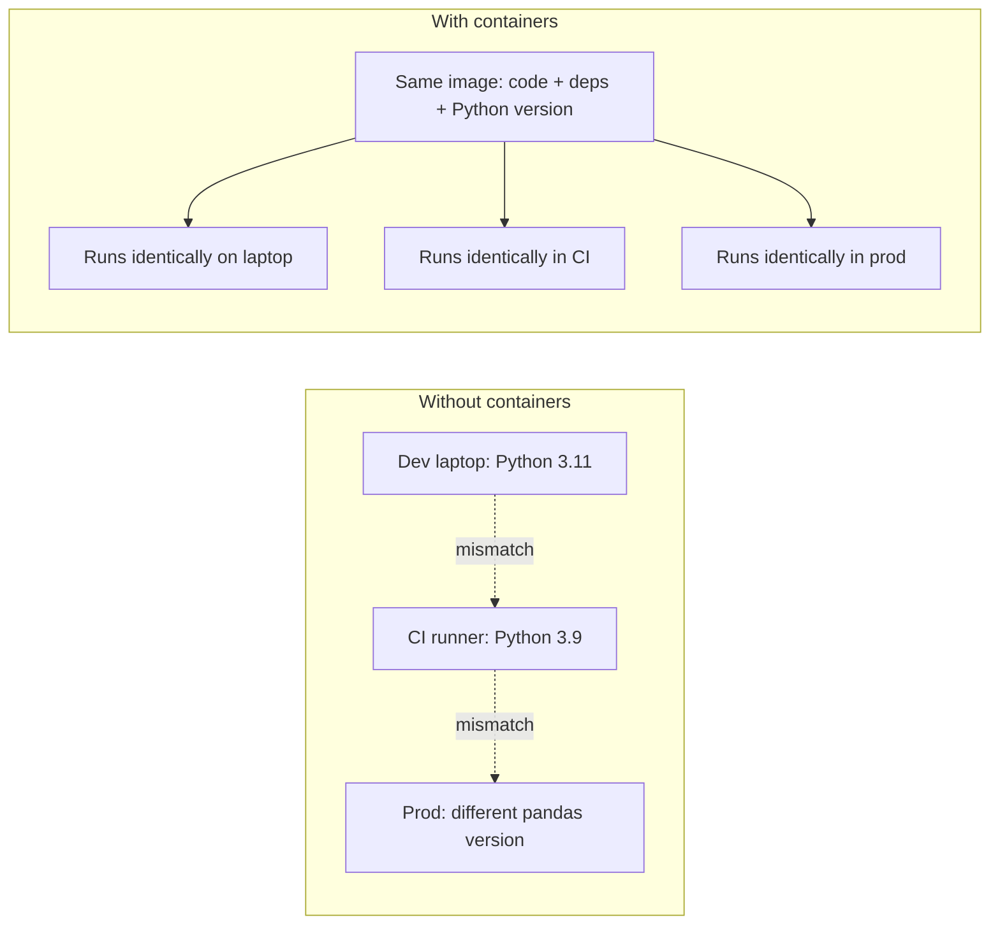
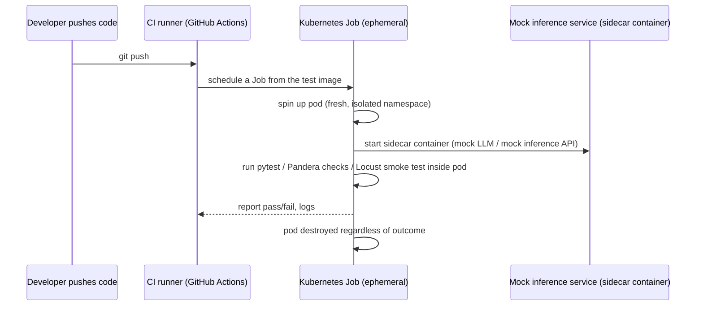

# Docker & Kubernetes for test environments — concepts only

You already know Docker/K8s exist. This section is scoped to what's
**specific to testing ML/GenAI systems**, since that's what an interviewer
is actually probing when they bring this up — not "do you know what a pod
is."

## Why containerize test environments at all

The point: "works on my machine" is especially dangerous for ML pipelines
because subtle version differences (numpy, pandas, a tokenizer library)
can silently change numerical output — not just crash loudly. A pinned
Docker image removes that variable from your test results.

## The pattern that matters: ephemeral, disposable test environments

Key ideas to be able to say out loud:
- **A Kubernetes `Job`** (not a long-running `Deployment`) is the right
  primitive for "run this test suite to completion, then stop" — it's
  designed to run a pod until success/failure and not restart it forever.
- **Sidecar containers**: your test pod can run a mock LLM/inference
  server *in the same pod* as the test runner, so tests hit
  `http://localhost:PORT` instead of a real network dependency — this is
  the containerized version of the `pytest-httpx` mocking you did on Day 1,
  just at the infrastructure level instead of the code level.
- **Namespace-per-PR / ephemeral environments**: some orgs spin up a full
  disposable copy of a staging environment per pull request so integration
  tests run against something real-ish, then tear it down. This is
  expensive and is usually reserved for integration/E2E suites, not unit
  tests.
- **`docker-compose` locally** mirrors this for local dev: one command
  (`docker compose up`) starts your app + mock inference service +
  Locust, so you can reproduce "what CI does" on your laptop without
  touching Kubernetes at all. Most day-to-day debugging happens here, not
  in K8s directly.

## What this buys you over "just run pytest in GitHub Actions"

GitHub Actions' hosted runners are already containers, so for a project
this size (a single Python test suite) you often *don't need* Kubernetes
at all — the `.github/workflows/qa-ds-bootcamp-ci.yml` file in this repo
runs directly on a GitHub-hosted Ubuntu runner, no K8s involved. Kubernetes
enters the picture when:
- your test suite needs multiple coordinated services (a mock inference
  API + a vector DB + a message queue) running together, reliably,
  on-demand;
- you need environment parity between "how CI tests it" and "how it's
  actually deployed" (if prod is K8s, testing in a K8s-like environment
  catches K8s-specific issues — resource limits, readiness probes, config
  maps — that a plain CI runner never would);
- you're running heavier jobs (load tests, GPU-backed model tests) that
  need to be scheduled onto specific node pools.

## What to say in the interview if asked "have you tested in K8s?"

Be honest and specific rather than vague: *"I haven't run tests inside
Kubernetes hands-on, but I understand the pattern — ephemeral Jobs, sidecar
mock services for hermetic tests, namespace-per-environment for
integration testing — and I have run this repo's test suite through
Docker via docker-compose to understand the containerization side."*
That's a stronger answer than either bluffing fluency you don't have, or
saying "no" and stopping there.

**Reality check: this is explicitly NOT a 3-day hands-on item.** Standing
up even a minimal local Kubernetes cluster (kind/minikube), writing a
Job manifest, and getting a sidecar mock service working reliably is
realistically a half-day-to-a-day investment on its own, and it's a small
fraction of the actual interview signal compared to Day 1/Day 2 hands-on
work. Know the concepts on this page fluently; don't try to build it.
