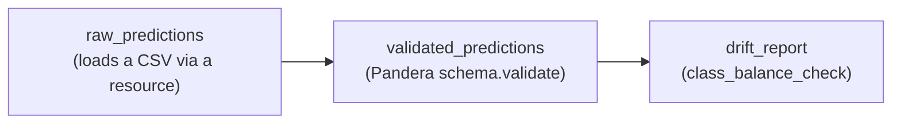

# Testing orchestrated pipelines: Airflow vs. Dagster, and why we build Dagster hands-on

The JD names both Airflow and Dagster test utilities. Both frameworks let
you compose pipeline stages into a DAG that a scheduler runs on a cadence.
The QA-relevant idea is the same for both: **your test suite should be
able to execute a stage (or the whole DAG) in-process, without a live
scheduler/webserver/metastore, and assert on its output** — the
orchestration-layer equivalent of everything you did in Day 1/Day 2 so
far.

## Airflow testing (know this, don't build it in 3 days)

- `airflow dags test <dag_id> <execution_date>` runs a full DAG run
  in-process for a given date, using a real (usually SQLite for local
  dev) metastore — closest to "the real thing" but requires an Airflow
  environment (metastore DB, `airflow db init`, DAG folder scanning) to
  even boot.
- **DAG integrity tests**: a very common, much lighter pattern —
  a pytest suite that imports every DAG module in your `dags/` folder and
  asserts: it parses without raising, has no import cycles, every task has
  `retries`/`execution_timeout` set, no two tasks share a `task_id`, etc.
  This catches "someone's PR breaks DAG parsing" before it ever reaches a
  scheduler. This is realistic to describe and even sketch in an
  interview without a full Airflow install.
- Task-level unit testing: call an operator's `execute()` method directly
  with a mocked context — heavier boilerplate than Dagster's equivalent.

## Dagster testing (what you'll build hands-on here)

Dagster's assets/ops are plain Python functions decorated with `@dg.asset`
/ `@dg.op`, and Dagster ships `dagster.materialize(...)` specifically so
you can **execute a set of assets in-process, in a normal pytest test,
with no scheduler or webserver running**. That's a meaningfully faster
path to real hands-on experience in a 3-day window, so that's what this
exercise uses — but the *concept* (in-process pipeline-stage execution
for tests) is the transferable interview answer for either tool.

## What you're building

Wiring three pieces from Day 2 Exercises A and B into a tiny Dagster
pipeline:

If `raw_predictions` is pointed at `good_predictions.csv`, the whole run
should succeed. If it's pointed at `broken_predictions.csv`, the
`validated_predictions` step should **fail the entire materialized run** —
proving a broken data contract stops the pipeline loudly instead of
letting a bad DataFrame flow silently into `drift_report`.

This exercise assumes you've already implemented `schemas/schema_todo.py`
and `validation/statistical_checks_todo.py` from Exercises A and B — it
imports directly from those files. If you haven't finished those yet, do
that first; this is the payoff of having done so.

Open `dagster_pipeline_todo.py` and follow the task list there.

## Checkpoint question

Why is "the whole pipeline run fails loudly and stops" a better property
for a data pipeline than "the bad DataFrame flows through and produces a
report nobody double-checks"? What's the cost difference between catching
this in a test vs. catching it in `drift_report`'s output three stages
downstream in production?
