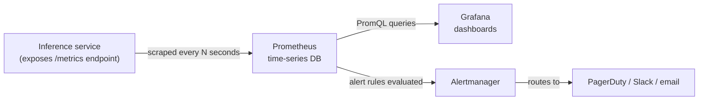

# Prometheus & Grafana for ML services — concepts only

Time-boxed on purpose: this section is conceptual fluency, not a
hands-on setup. Read it once, be ready to draw the diagram from memory.

## The flow

- **Prometheus** *pulls* (scrapes) metrics from your service on an
  interval — your service doesn't push to Prometheus, it just exposes a
  `/metrics` HTTP endpoint in a specific text format, and Prometheus polls
  it. This pull model is the single most commonly-tested "explain this"
  fact about Prometheus.
- **Grafana** doesn't store anything itself here — it's a query/dashboard
  layer on top of Prometheus's stored time series (via PromQL).
- **Alertmanager** takes alert rules defined against Prometheus data (e.g.
  "p95 latency > 1s for 5 minutes") and handles routing/deduplication/
  silencing before paging a human.

## What to monitor: standard service metrics (the RED method)

For any request-driven service, ML or not:
- **R**ate — requests/sec
- **E**rrors — error rate (5xx, timeouts)
- **D**uration — latency distribution (p50/p95/p99 — **always look at
  percentiles, never just average**; a service can have a great average
  latency and a terrible p99 that's silently ruining the experience for
  1-in-100 users)

This is exactly what your Locust exercise measured by hand for one run —
Prometheus/Grafana is "run that measurement continuously, forever, in
production, with alerting," not a fundamentally different idea.

## What's DIFFERENT for ML/GenAI services specifically

A generic web service's RED metrics don't tell you if the *model* is
behaving well — only if the *service* is up. ML-specific signals to know
about:

| Metric category | Example | Why it matters |
|---|---|---|
| Prediction distribution | Histogram of predicted labels/confidence over time | Silent model collapse (e.g. suddenly predicting "other" 90% of the time) won't throw a 500 error — RED metrics stay green while the model is quietly broken |
| Input/output drift | KS-statistic or PSI (population stability index) between a reference window and the current window | This is the production version of the `detect_confidence_drift` function from Day 2 — same idea, run continuously |
| Token usage / cost | Tokens in/out per request, $ per request | LLM-specific: a bad prompt change or a runaway agent loop shows up as a cost spike before it shows up as a correctness bug |
| Latency by model/provider | p95 broken out by which model/provider served the request | Multi-model or multi-provider setups need per-backend breakdowns, not just an aggregate |
| Judge/eval scores over time | Rolling average of your LLM-as-judge hallucination score (Day 1) | Ties your offline eval work (Day 1) into a live production signal instead of only running at CI time |

## The one-sentence answer to "how would you monitor this in prod"

*"Standard RED metrics (rate/errors/duration, especially p95/p99 latency)
via Prometheus scraping a `/metrics` endpoint, visualized in Grafana, plus
ML-specific signals layered on top — prediction distribution and
confidence drift so a model that's silently degrading (not crashing) still
trips an alert, and for LLM features specifically, token cost per request
and a rolling LLM-judge score so a quality regression shows up as a
dashboard trend, not just an angry user ticket."*

**Reality check:** actually standing up Prometheus + Grafana + a scrape
config + a dashboard is a very learnable half-day project — genuinely not
worth spending 3-day-prep time on. Fluency in this page's content, plus
having already built the drift-detection *logic* by hand in Day 2, covers
the interview signal this topic is testing for.
