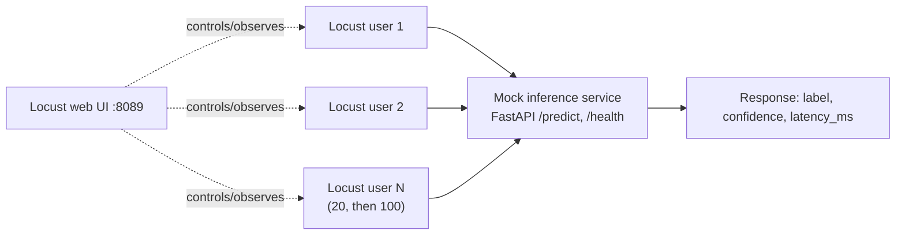

# Day 3 — Performance Testing, Observability, Mock Interview

**Time budget: ~3-4 focused hours**, split roughly: 1.5h load testing,
45 min observability concepts, 1.5h+ mock interview.

## What you're load-testing



## Setup and run order

```bash
cd QA-Data-Science-Engineer-Bootcamp/day3_perf_observability_interview
pip install -r ../requirements-qa.txt

# Terminal 1
uvicorn mock_service.inference_server:app --port 8000

# Terminal 2
locust -f load_test/locustfile_todo.py --host http://localhost:8000
# open http://localhost:8089
```

## Order of operations

| # | Step | Files |
|---|------|-------|
| 1 | Implement + run the Locust exercise at 20 users, then 100 | `load_test/locustfile_todo.py` |
| 2 | Read (don't run) the k6 comparison | `load_test/k6_script_reference.js` |
| 3 | Read the observability concepts doc | `observability_concepts/prometheus_grafana_conceptual.md` |
| 4 | Read the interview question bank, then do the live mock interview in chat | `mock_interview/questions.md` |

## Interpreting your Locust run (do this together, in chat, after you run it)

Bring back: p95 latency at 20 users vs. 100 users, requests/sec at each
level, and whether/how failures appeared. We'll talk through what those
numbers actually mean for capacity planning, and where this mock service's
behavior is unrealistic vs. a real model server (hint: real GPU-backed
inference has near-zero variance until it saturates, then it falls off a
cliff — very different shape from this mock's uniform random latency).

## Checkpoint quiz

1. Why does `wait_time = between(0.5, 2)` matter for how realistic this
   load test is? What would change if every simulated user fired requests
   back-to-back with zero wait?
2. What's the practical difference in how Locust (`thresholds` don't
   exist) vs. k6 (`thresholds` in `options`) decide pass/fail? Which one
   is easier to drop into a CI pipeline as a hard gate, and why?
3. Prometheus scrapes (pulls); what's the tradeoff vs. a push-based
   metrics model? (You don't need to have used both — reason about it.)
4. Give one concrete ML-specific metric (not rate/errors/duration) you'd
   want on a dashboard for an LLM feature in production, and what
   incident it would help you catch that RED metrics alone would miss.

## Reality check

- **Realistic hands-on in 3 days:** running Locust against a local mock
  service and reading its output correctly (this is the whole Day 3
  hands-on scope, and it's enough).
- **Not realistic hands-on in 3 days:** running k6, setting up real
  Prometheus + Grafana + Alertmanager, load-testing a real GPU-backed
  model server and interpreting its actual saturation curve. Know these
  fluently via the docs in this folder; don't attempt to build them.
- **Also worth saying explicitly in an interview if asked:** most real
  orgs do NOT run full load tests on every commit (too slow, too
  expensive) — they run on a schedule, before a release, or when
  infrastructure changes. Day 3's CI workflow deliberately does not
  include the Locust test as a merge gate, unlike Day 1/Day 2 — that
  omission is itself a design decision worth being able to defend.
